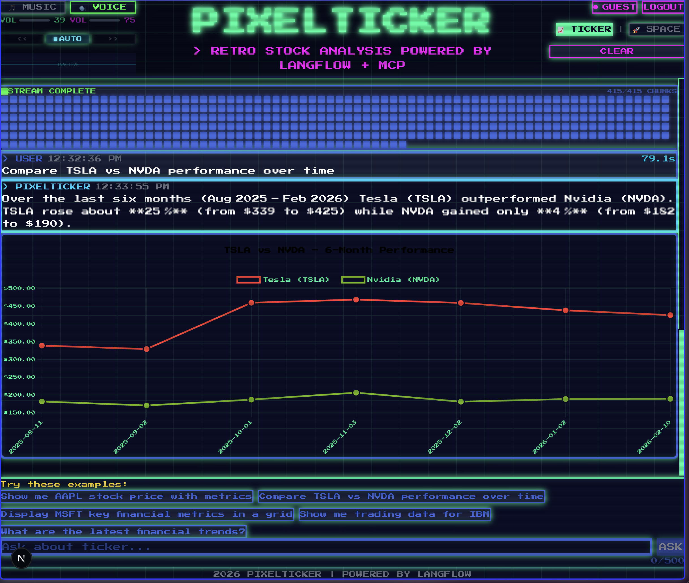
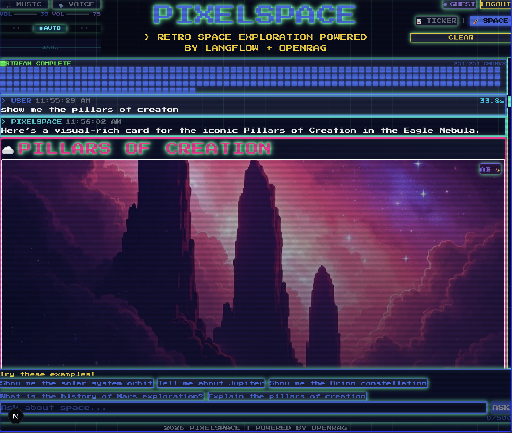
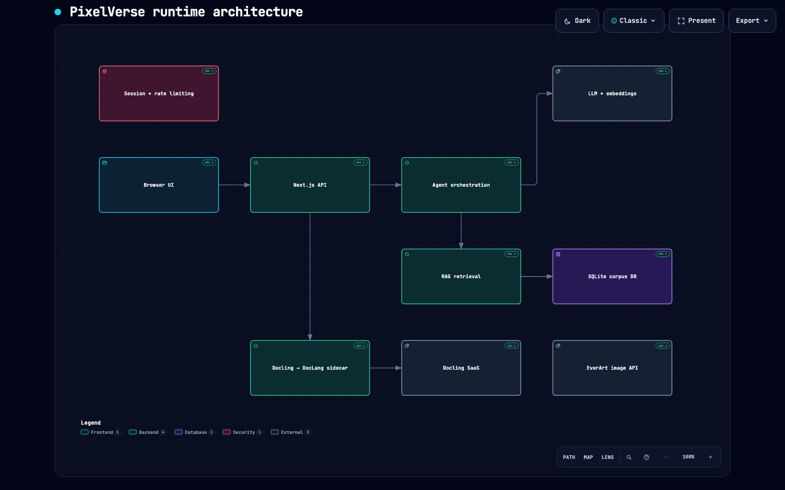
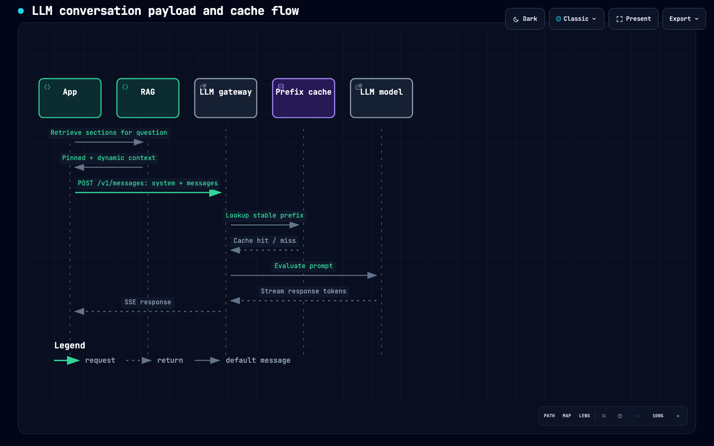
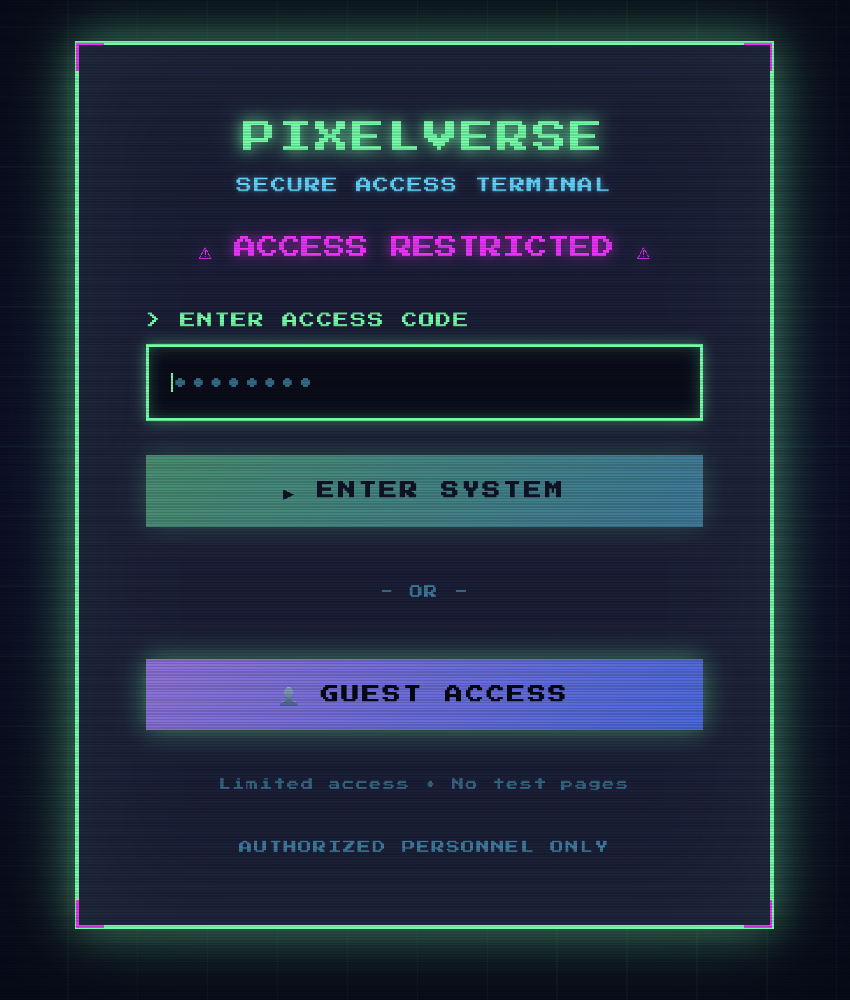

<div align="center">

<pre style="font-family: monospace; line-height: 1.2;">
<span style="color: #ff00ff;">████████████████████████████████████████████████████████████████████████████████</span>
<span style="color: #ff00ff;">█</span>                                                                              <span style="color: #ff00ff;">█</span>
<span style="color: #ff00ff;">█</span>  <span style="color: #00ff9f;">██████╗ ██╗██╗  ██╗███████╗██╗</span>     <span style="color: #00d4ff;">██╗   ██╗███████╗██████╗ ███████╗███████╗</span>
<span style="color: #ff00ff;">█</span>  <span style="color: #00ff9f;">██╔══██╗██║╚██╗██╔╝██╔════╝██║</span>     <span style="color: #00d4ff;">██║   ██║██╔════╝██╔══██╗██╔════╝██╔════╝</span>
<span style="color: #ff00ff;">█</span>  <span style="color: #00ff9f;">██████╔╝██║ ╚███╔╝ █████╗  ██║</span>     <span style="color: #00d4ff;">██║   ██║█████╗  ██████╔╝███████╗█████╗</span>
<span style="color: #ff00ff;">█</span>  <span style="color: #00ff9f;">██╔═══╝ ██║ ██╔██╗ ██╔══╝  ██║</span>     <span style="color: #00d4ff;">╚██╗ ██╔╝██╔══╝  ██╔══██╗╚════██║██╔══╝</span>
<span style="color: #ff00ff;">█</span>  <span style="color: #00ff9f;">██║     ██║██╔╝ ██╗███████╗███████╗</span> <span style="color: #00d4ff;">╚████╔╝ ███████╗██║  ██║███████║███████╗</span>
<span style="color: #ff00ff;">█</span>  <span style="color: #00ff9f;">╚═╝     ╚═╝╚═╝  ╚═╝╚══════╝╚══════╝</span>  <span style="color: #00d4ff;">╚═══╝  ╚══════╝╚═╝  ╚═╝╚══════╝╚══════╝</span>
<span style="color: #ff00ff;">█</span>                                                                              <span style="color: #ff00ff;">█</span>
<span style="color: #ff00ff;">████████████████████████████████████████████████████████████████████████████████</span>
</pre>


</div>

<div align="center">

**Welcome to the <span style="color: #00ff9f;">Pixel</span><span style="color: #00d4ff;">Verse</span>.** Your gateway to a retro agentic experience where cyberpunk aesthetics meet cutting-edge AI. Powered by [Docling](https://github.com/DS4SD/docling), [DocLang](https://github.com/doclang-project/doclang/), and [MCP](https://modelcontextprotocol.io).

<br/>

[](https://github.com/DS4SD/docling)
[](https://github.com/doclang-project/doclang/)


</div>

---

<table align="center">
<tr>
<td width="45%" align="center" valign="top">

### 📈 PixelTicker



**Stock Analysis** • Ask natural language questions about stock performance with AI-powered insights and pixel art styled charts

</td>
<td width="10%"></td>
<td width="45%" align="center" valign="top">

### 🌌 PixelSpace



**Space Exploration** • Explore the cosmos with AI-powered space data, celestial visualizations, and interactive timelines

</td>
</tr>
</table>

<div align="center">

</div>

## 🚀 Quick Start

### Prerequisites
- `Node.js 18+` installed
- `npm` or `yarn` package manager

### Installation

**[STEP 1]** Install dependencies:
```bash
$ npm install
# Installing PixelVerse dependencies...
# ████████████████████████████████████████ 100%
```

**[STEP 2]** Configure environment:
```bash
$ cp .env.example .env.local
# Environment template copied
# Edit .env.local with your API keys
```
📝 See [Configuration](#-configuration) for detailed setup

**[STEP 3]** Launch application:
```bash
$ npm run dev
# Starting PixelVerse development server...
# ✓ Ready on http://localhost:3000
```

<div align="center">

```diff
+ ACCESS GRANTED
```

🌐 Navigate to `http://localhost:3000`

Click **"GUEST ACCESS"** to enter the PixelVerse

</div>

> 💡 **GUEST MODE**: Full access to PixelTicker & PixelSpace • No authentication required
> 🔐 **FULL AUTH**: Includes test pages • See [Authentication](#-authentication)

```
═══════════════════════════════════════════════════════════════════════════════
```

## 🛠️ Tech Stack

- **Framework**: Next.js 16.1.4 with App Router
- **Language**: TypeScript
- **Styling**: Tailwind CSS + Custom CSS
- **Charts**: Chart.js + react-chartjs-2
- **Font**: [Press Start 2P](https://fonts.google.com/specimen/Press+Start+2P)

## 🏗️ Runtime Architecture

The high-level runtime architecture shows the main request, retrieval, document-ingestion, and external-service paths:

[](architecture.html)

- [Open the interactive architecture diagram](architecture.html)
- [View the architecture specification](architecture.json)

## ⚙️ Configuration

### Environment Variables

Copy the example environment file and configure it:
```bash
cp .env.example .env.local
```

Edit `.env.local` and set your values:
```js
# Authentication (REQUIRED - minimum 8 characters)
AUTH_PASSWORD=your_secure_password_here

# LLM — OpenAI-compatible key + model
LLM_API_KEY=your_llm_api_key_here
# LLM_MODEL=gpt-4o-mini
# LLM_BASE_URL=https://your-provider.com/v1

# Embeddings — can reuse LLM_API_KEY if same provider
EMBED_API_KEY=your_embed_api_key_here
# EMBED_MODEL=text-embedding-3-small
# EMBED_BASE_URL=https://your-provider.com/v1

# EverArt — pixel-art image generation for celestial body cards
EVERART_API_KEY=your_everart_api_key_here

# RAG corpus DB (built once via: npx tsx scripts/ingest-corpus.ts)
# RAG_DB_PATH=data/corpus.db

# Docling — "local" or "saas" (see Docling Setup section)
DOCLING_MODE=local
DOCLING_SIDECAR_URL=http://localhost:7421
# DOCLING_API_URL=https://your-docling-instance.com  # required for saas mode
# DOCLING_API_KEY=your_docling_api_key_here          # required for saas mode
```

**Important Security Notes:**
- Set a strong password for `AUTH_PASSWORD` (minimum 8 characters, 12+ recommended for production)
- All required environment variables are validated at startup
- See `.env.example` for detailed documentation and all optional variables

### Docling Setup

Set `DOCLING_MODE` in `.env.local` to choose how documents are converted to DocLang:

| `DOCLING_MODE` | How it works | Required vars |
|----------------|--------------|---------------|
| `local` (default) | Sidecar runs `DocumentConverter` + `export_to_doclang()` on-device | `DOCLING_SIDECAR_URL` |
| `saas` | Docling SaaS handles OCR/layout; sidecar calls `export_to_doclang()` on the result JSON | `DOCLING_API_URL` + `DOCLING_API_KEY` + `DOCLING_SIDECAR_URL` |

Both modes produce native DocLang (tables, `<location>` tags, OTSL markup preserved). The sidecar is required for both.

**Sidecar setup (required for both modes)**

**Prerequisites:** Python 3.10+ installed

**Install once:**
```bash
npm run setup:sidecar
```

**Start** (sidecar launches automatically alongside Next.js):
```bash
npm run dev
```

Or standalone from the repo root:
```bash
sidecar/.venv/bin/uvicorn sidecar.main:app --port 7421
```

**`DOCLING_MODE=local`**

```js
DOCLING_MODE=local
DOCLING_SIDECAR_URL=http://localhost:7421
```

**`DOCLING_MODE=saas`**

```js
DOCLING_MODE=saas
DOCLING_SIDECAR_URL=http://localhost:7421
DOCLING_API_URL=https://your-docling-instance.com
DOCLING_API_KEY=your_docling_api_key_here
```

---

The RAG corpus is built once after setup:
```bash
npx tsx scripts/ingest-corpus.ts
```

## ⚡ Prompt Caching & Pinned Documents

PixelVerse optimizes LLM latency and token costs through prefix caching with LLM / Gateway providers.

When pinning entire documents (`PIN` feature in the Corpus selector), the payload separates **static prefixes** from **dynamic question context**:

### LLM Conversation Flow

The sequence diagram shows how questions, RAG context, system and user messages, prompt-prefix caching, and streamed responses move through the LLM pipeline:

[](conversation-sequence.html)

- [Open the interactive LLM conversation diagram](conversation-sequence.html)
- [View the diagram specification](conversation-sequence.json)

---

## 🔐 Authentication

<div align="center">

</div>

<br/>

On first visit, you'll see an authentication page with two access options:

#### Full Authentication
Enter the password you set in `AUTH_PASSWORD` to get full access to all features including test pages.

#### Guest Access
Click "GUEST ACCESS" for limited access to main application features. Guest users can:
- ✅ Use PixelTicker (stock analysis)
- ✅ Use PixelSpace (space exploration)
- ✅ Access all main features
- ❌ Cannot access test pages (`/test-*` routes)

**Security Features:**
- Rate limiting (5 attempts per minute per IP)
- Secure httpOnly cookies
- Session management
- Two-tier access control (authenticated vs guest)
- Test pages require full authentication
- User status indicator in header (AUTH/GUEST badge)
- Logout functionality

**Access Control:**
- **Public**: `/auth`, public assets, API auth endpoints
- **Guest or Authenticated**: Main app pages (`/`, PixelTicker, PixelSpace)
- **Authenticated Only**: Test pages (`/test-*`)

**To change the password:**
1. Update `AUTH_PASSWORD` in `.env.local`
2. Restart the development server
3. Clear your browser cookies or use incognito mode

**To logout:**
- Click the "LOGOUT" button in the header (visible on all pages)
- You'll be redirected to the authentication page

## 🎯 Usage

1. **Configure Docling** — see [Docling Setup](#docling-setup) for the three conversion modes (local sidecar, SaaS + sidecar, or SaaS-only). Run `npm run setup:sidecar` if using the sidecar, then `npm run dev`. Ingest the RAG corpus once with `npx tsx scripts/ingest-corpus.ts`
2. **Open PixelTicker** in your browser
3. **Ask stock questions** like:
   - "How has IBM's stock performed over the last 2 weeks?"
   - "What is Apple's current stock price?"
   - "Compare AAPL vs GOOGL performance"
   - "Show me Tesla stock trends"
4. **View results** in the pixel art chart and conversation history

## 🔒 Security

### Environment Variable Validation

All environment variables are validated at application startup to prevent security vulnerabilities:

**VULN-003 (Critical) - API Key Validation:**
- `LLM_API_KEY`, `EMBED_API_KEY`, and `EVERART_API_KEY` must be non-empty
- Keys are validated at both startup and runtime
- Recommendation: Rotate API keys every 90 days

**Authentication:**
- `AUTH_PASSWORD` must be at least 8 characters (12+ recommended for production)
- Passwords are validated at startup
- Use strong, unique passwords

**Validation Behavior:**
- Application fails fast if required variables are missing or invalid
- Clear error messages guide configuration
- Warnings are shown for optional variables or weak configurations

For detailed security documentation, see `.env.example`.

## 🤝 Contributing

This is a demo application. Feel free to fork and customize for your needs!

## 📄 License

MIT License - feel free to use this project for learning and development.

---

**Built with ❤️ using Next.js, Docling, DocLang, and MCP**
