# Constellation Rendering Guide: Celestial Coordinate Projection & Line Generation

## Introduction

This guide documents the technical implementation of constellation rendering in the PixelTicker application, covering two key aspects:

1. **Coordinate Projection**: How we convert celestial coordinates (Right Ascension and Declination) into accurate 2D canvas positions using d3-geo map projections
2. **Line Generation**: How we automatically generate non-crossing constellation lines using Delaunay triangulation and Minimum Spanning Tree algorithms

**Why this guide exists**: During development, we discovered that naively plotting celestial coordinates as simple X/Y values produces severe distortions, especially for high-declination constellations. Additionally, agent-generated constellation lines often crossed inappropriately. This guide explains both the cartographic solution and the algorithmic line generation we implemented.

## The Fundamental Problem

### Celestial Coordinates Are Spherical

Stars are positioned on the celestial sphere using two angular coordinates:

- **Right Ascension (RA)**: Angular distance eastward along the celestial equator (0-24 hours or 0-360°)
- **Declination (Dec)**: Angular distance north (+) or south (-) of the celestial equator (-90° to +90°)

These coordinates describe positions on a **sphere**, not a flat plane.

### You Can't Directly Plot Spherical Coordinates on 2D Canvas

The naive approach of treating RA as X and Dec as Y fails because:

1. **Spherical geometry is non-Euclidean**: Distances and angles don't behave the same way as on a flat surface
2. **RA circles shrink at higher declinations**: At the celestial equator (Dec = 0°), one hour of RA spans 15° of arc. At Dec = 60°, that same hour spans only 7.5° of actual angular distance due to the `cos(declination)` factor
3. **Polar regions require special handling**: Near the celestial poles (Dec ≈ ±90°), RA becomes meaningless as all meridians converge

### Observable Distortion Pattern

When we initially plotted constellations using naive X/Y mapping:

- **Orion (Dec ≈ 0°)**: Appeared correct ✓
- **Cygnus (Dec ≈ 40°)**: Noticeably stretched horizontally ✗
- **Ursa Major (Dec ≈ 56°)**: Severely distorted, unrecognizable ✗
- **Ursa Minor (Dec ≈ 89°)**: Completely broken, stars collapsed ✗

The distortion increased with declination because we weren't accounting for spherical geometry.

## Understanding Map Projections

### Cartography Basics Applied to the Celestial Sphere

A **map projection** is a systematic transformation of the spherical surface onto a plane. Every projection involves trade-offs:

- **Conformal projections**: Preserve local angles and shapes (but distort area)
- **Equal-area projections**: Preserve relative sizes (but distort shapes)
- **Equidistant projections**: Preserve distances from a central point
- **Compromise projections**: Balance multiple properties

For constellation rendering, we prioritize **shape preservation** (conformal) and **accurate angular relationships** over area preservation.

### Why We Need Different Projections

No single projection works well for all declinations:

- **Low declinations (0-30°)**: Simple projections work fine
- **Mid declinations (30-60°)**: Need spherical correction
- **High declinations (60-80°)**: Require conformal projections
- **Polar regions (>80°)**: Need azimuthal projections centered on the pole

Our solution: **automatically select the optimal projection** based on constellation bounds.

## IAU Sky Chart Convention

### The Horizontal Flip

Astronomical sky charts follow the **IAU (International Astronomical Union) convention**:

- **RA increases from right to left** (opposite of typical X-axis)
- This matches the view when looking **up at the sky from Earth**
- East is to the left, West is to the right

In d3-geo, we implement this with:

```typescript
projection.reflectX(true)
```

This horizontal reflection ensures our rendered constellations match printed star charts and planetarium software.

### Why This Convention?

When you look up at the night sky:
- You're looking at the **inside** of the celestial sphere
- East appears on your left, West on your right
- RA increases eastward, so it increases left-to-right in the sky
- But on a chart, we want to match that sky view, so RA increases right-to-left on paper

## The Spherical Correction Formula

### The Cosine Factor

The key mathematical insight is that **RA circles shrink at higher declinations**:

```
Angular width = RA range × cos(declination)
```

At the celestial equator (Dec = 0°):
- `cos(0°) = 1.0`
- One hour of RA = 15° of angular distance

At Dec = 60°:
- `cos(60°) = 0.5`
- One hour of RA = 7.5° of angular distance

At Dec = 89°:
- `cos(89°) ≈ 0.017`
- One hour of RA ≈ 0.26° of angular distance

### Implementation

```typescript
const meanDecRadians = (meanDec * Math.PI) / 180;
const raAngularRange = (raMax - raMin) * Math.cos(meanDecRadians);
```

This correction is **critical** for equirectangular projections to avoid horizontal stretching at high declinations.

## Projection Types

### 1. Equirectangular Projection

**Best for**: Mid-latitude constellations (0-60° declination)

**How it works**: 
- Simple cylindrical projection
- Maps longitude (RA) and latitude (Dec) directly to X and Y
- Applies spherical correction via `cos(declination)`
- Uses `.rotate()` to center the view on the constellation

**Advantages**:
- Computationally simple
- Preserves north-south relationships
- Good for wide-ranging constellations

**Limitations**:
- Distorts shapes at high declinations
- Not suitable for polar regions

**d3-geo Configuration**:

```typescript
const projection: GeoProjection = geoEquirectangular()
  .rotate([-meanRa, -meanDec, 0])  // Center on constellation
  .reflectX(true);                  // IAU convention (RA increases right-to-left)

// Apply spherical correction to RA range
const meanDecRadians = (meanDec * Math.PI) / 180;
const raAngularRange = (raMax - raMin) * Math.cos(meanDecRadians);
const decRange = decMax - decMin;
const maxRange = Math.max(raAngularRange, decRange);

// Scale to fit canvas
const drawableSize = canvasSize - 2 * padding;
const scale = drawableSize / (maxRange * Math.PI / 180);

projection.scale(scale);
projection.translate([canvasSize / 2, canvasSize / 2]);
```

**Code Example** (from `celestial-coordinates.ts:252-311`):

```typescript
function equirectangularToCanvas(
  ra: number,
  dec: number,
  bounds: ConstellationBounds,
  canvasSize: number,
  padding: number
): CanvasCoordinate {
  const { raMin, raMax, decMin, decMax } = bounds;
  const meanRa = (raMin + raMax) / 2;
  const meanDec = (decMin + decMax) / 2;
  
  const projection: GeoProjection = geoEquirectangular()
    .rotate([-meanRa, -meanDec, 0])
    .reflectX(true);
  
  // Apply spherical correction
  const meanDecRadians = (meanDec * Math.PI) / 180;
  const raAngularRange = (raMax - raMin) * Math.cos(meanDecRadians);
  const decRange = decMax - decMin;
  const maxRange = Math.max(raAngularRange, decRange);
  
  // Adaptive padding for small constellations
  const minPadding = padding * 0.3;
  const adaptivePadding = maxRange < 20
    ? Math.max(minPadding, padding * (maxRange / 20))
    : padding;
  
  const drawableSize = canvasSize - 2 * adaptivePadding;
  const scale = drawableSize / (maxRange * Math.PI / 180);
  
  projection.scale(scale);
  projection.translate([canvasSize / 2, canvasSize / 2]);
  
  const projected = projection([ra, dec]);
  
  if (!projected) {
    return { x: canvasSize / 2, y: canvasSize / 2 };
  }
  
  return {
    x: Math.round(projected[0]),
    y: Math.round(projected[1])
  };
}
```

### 2. Stereographic Projection

**Best for**: High-latitude constellations (60-70° declination)

**How it works**:
- Conformal projection (preserves local angles and shapes)
- Projects from a point on the sphere through the surface onto a plane
- Centered on the constellation's mean position
- Minimal distortion near the center point

**Advantages**:
- Preserves constellation shapes accurately
- Smooth, continuous mapping
- No singularities within the projection area

**Limitations**:
- Scale varies with distance from center
- Not ideal for very wide-ranging constellations
- Breaks down at the antipodal point

**d3-geo Configuration**:

```typescript
const projection: GeoProjection = geoStereographic()
  .center([meanRa, meanDec])  // Center on constellation
  .rotate([0, 0, 0]);          // No additional rotation needed

const raAngularRange = raMax - raMin;
const decRange = decMax - decMin;
const maxRange = Math.max(raAngularRange, decRange);

const drawableSize = canvasSize - 2 * padding;
const scale = (drawableSize / 2) / (maxRange * Math.PI / 180);

projection.scale(scale);
projection.translate([canvasSize / 2, canvasSize / 2]);
```

**Code Example** (from `celestial-coordinates.ts:193-239`):

```typescript
function stereographicToCanvas(
  ra: number,
  dec: number,
  bounds: ConstellationBounds,
  canvasSize: number,
  padding: number
): CanvasCoordinate {
  const { raMin, raMax, decMin, decMax } = bounds;
  const meanDec = (decMin + decMax) / 2;
  const meanRa = (raMin + raMax) / 2;
  
  const projection: GeoProjection = geoStereographic()
    .center([meanRa, meanDec])
    .rotate([0, 0, 0]);
  
  const raAngularRange = raMax - raMin;
  const decRange = decMax - decMin;
  const maxRange = Math.max(raAngularRange, decRange);
  
  // Adaptive padding
  const minPadding = padding * 0.3;
  const adaptivePadding = maxRange < 20
    ? Math.max(minPadding, padding * (maxRange / 20))
    : padding;
  
  const drawableSize = canvasSize - 2 * adaptivePadding;
  const scale = (drawableSize / 2) / (maxRange * Math.PI / 180);
  
  projection.scale(scale);
  projection.translate([canvasSize / 2, canvasSize / 2]);
  
  const projected = projection([ra, dec]);
  
  if (!projected) {
    return { x: canvasSize / 2, y: canvasSize / 2 };
  }
  
  return {
    x: Math.round(projected[0]),
    y: Math.round(projected[1])
  };
}
```

### 3. Azimuthal Equidistant Projection

**Best for**: Polar/circumpolar constellations (>70° declination)

**How it works**:
- Projects from the celestial pole
- Preserves distances from the center (pole)
- All meridians (RA lines) radiate from the center
- Declination circles are concentric

**Advantages**:
- Perfect for polar regions
- No singularity at the pole
- Accurate angular relationships around the pole
- Natural representation of circumpolar motion

**Limitations**:
- Only suitable for high-declination constellations
- Distorts shapes far from the pole

**d3-geo Configuration**:

```typescript
const isNorthern = meanDec > 0;
const poleDec = isNorthern ? 90 : -90;

const projection: GeoProjection = geoAzimuthalEquidistant()
  .rotate([0, -poleDec, 180]);  // Center on pole, 180° flip for IAU convention

const maxPoleDistance = Math.max(
  Math.abs(poleDec - decMin),
  Math.abs(poleDec - decMax)
);

const drawableSize = canvasSize - 2 * padding;
const scale = (drawableSize / 2) / (maxPoleDistance * Math.PI / 180);

projection.scale(scale);
projection.translate([canvasSize / 2, canvasSize / 2]);
```

**Code Example** (from `celestial-coordinates.ts:117-181`):

```typescript
function azimuthalEquidistantToCanvas(
  ra: number,
  dec: number,
  bounds: ConstellationBounds,
  canvasSize: number,
  padding: number
): CanvasCoordinate {
  const { raMin, raMax, decMin, decMax } = bounds;
  const meanDec = (decMin + decMax) / 2;
  
  const isNorthern = meanDec > 0;
  const poleDec = isNorthern ? 90 : -90;
  
  // For d3-geo azimuthal projections:
  // rotate([λ, φ, γ]) where:
  //   λ: rotation around vertical axis
  //   φ: negative of the latitude to center on
  //   γ: rotation around viewing axis (180° for IAU convention)
  const projection: GeoProjection = geoAzimuthalEquidistant()
    .rotate([0, -poleDec, 180]);
  
  const maxPoleDistance = Math.max(
    Math.abs(poleDec - decMin),
    Math.abs(poleDec - decMax)
  );
  
  // Adaptive padding for small constellations
  const minPadding = padding * 0.3;
  const adaptivePadding = maxPoleDistance < 20
    ? Math.max(minPadding, padding * (maxPoleDistance / 20))
    : padding;
  
  const drawableSize = canvasSize - 2 * adaptivePadding;
  const scale = (drawableSize / 2) / (maxPoleDistance * Math.PI / 180);
  
  projection.scale(scale);
  projection.translate([canvasSize / 2, canvasSize / 2]);
  
  const projected = projection([ra, dec]);
  
  if (!projected) {
    return { x: canvasSize / 2, y: canvasSize / 2 };
  }
  
  return {
    x: Math.round(projected[0]),
    y: Math.round(projected[1])
  };
}
```

## Automatic Projection Selection

### Decision Logic

The `selectProjectionType()` function automatically chooses the optimal projection based on constellation bounds:

```typescript
export function selectProjectionType(bounds: ConstellationBounds): ProjectionType {
  const { raMin, raMax, decMin, decMax } = bounds;
  const raRange = raMax - raMin;
  const decRange = decMax - decMin;
  const meanDec = (decMin + decMax) / 2;
  const absMeanDec = Math.abs(meanDec);
  const absMaxDec = Math.max(Math.abs(decMin), Math.abs(decMax));

  // Detect circumpolar constellations
  const isCircumpolar = absMeanDec > 60 && (
    absMaxDec > 70 ||   // Any star extends above 70°
    raRange > 90        // Wraps significantly around pole
  );

  if (isCircumpolar) {
    return 'azimuthal-equidistant';
  }

  // High latitude constellations (60-70°)
  if (absMeanDec >= 60 && absMeanDec <= 70) {
    const raDecRatio = raRange / Math.max(decRange, 1);
    if (raRange > 60 || raDecRatio > 3) {
      return 'equirectangular';  // Wide-ranging
    }
    return 'stereographic';  // Compact
  }

  // Default: equirectangular for mid-low latitudes
  return 'equirectangular';
}
```

### Decision Tree

```mermaid
graph TD
    A[Calculate Constellation Bounds] --> B{Mean Dec > 60°?}
    B -->|No| C[Equirectangular]
    B -->|Yes| D{Max Dec > 70° OR<br/>RA Range > 90°?}
    D -->|Yes| E[Azimuthal Equidistant<br/>Circumpolar]
    D -->|No| F{RA Range > 60° OR<br/>RA/Dec Ratio > 3?}
    F -->|Yes| G[Equirectangular<br/>Wide-ranging]
    F -->|No| H[Stereographic<br/>Compact high-lat]
```



### Examples

| Constellation | Mean Dec | Max Dec | RA Range | Selected Projection | Reason |
|--------------|----------|---------|----------|---------------------|---------|
| Orion | 0° | 10° | 34° | Equirectangular | Low declination |
| Cygnus | 40° | 50° | 45° | Equirectangular | Mid declination |
| Cassiopeia | 60° | 63° | 50° | Stereographic | High-lat, compact |
| Ursa Major | 56° | 62° | 75° | Equirectangular | High-lat, wide |
| Ursa Minor | 75° | 89° | 360° | Azimuthal Equidistant | Circumpolar |
| Cepheus | 68° | 78° | 120° | Azimuthal Equidistant | Extends >70° |

## Implementation Guide

### Basic Usage

```typescript
import { convertStarsToCanvas } from '@/utils/celestial-coordinates';

const stars = [
  { ra: "5h 55m", dec: "+7° 24'" },  // Betelgeuse
  { ra: "5h 14m", dec: "-8° 12'" },  // Rigel
  // ... more stars
];

// Automatic projection selection and conversion
const canvasCoords = convertStarsToCanvas(stars, 400, 50);
```

### With Projection Information

```typescript
import { convertStarsToCanvasWithProjection } from '@/utils/celestial-coordinates';

const result = convertStarsToCanvasWithProjection(stars, 400, 50);

console.log(result.projectionType);  // 'equirectangular' | 'stereographic' | 'azimuthal-equidistant'
console.log(result.bounds);          // { raMin, raMax, decMin, decMax }
console.log(result.coordinates);     // Array of { x, y }
```

### React Component Integration

```typescript
import { useMemo } from 'react';
import { convertStarsToCanvas } from '@/utils/celestial-coordinates';

function ConstellationVisualization({ stars }) {
  const canvasCoords = useMemo(() => {
    const starsForConversion = stars.map(star => ({
      ra: star.ra || '0h 0m',
      dec: star.dec || '+0° 0\''
    }));
    
    return convertStarsToCanvas(starsForConversion, 400, 50);
  }, [stars]);

  return (
    <svg viewBox="0 0 400 400">
      {canvasCoords.map((coord, i) => (
        <circle
          key={i}
          cx={coord.x}
          cy={coord.y}
          r={5}
          fill="white"
        />
      ))}
    </svg>
  );
}
```

## Common Pitfalls

### 1. Forgetting the Horizontal Flip

**Problem**: Constellation appears mirrored compared to sky charts.

**Solution**: Always use `.reflectX(true)` for equirectangular projections to match IAU convention.

```typescript
// ❌ Wrong - will be mirrored
const projection = geoEquirectangular()
  .rotate([-meanRa, -meanDec, 0]);

// ✅ Correct - matches sky view
const projection = geoEquirectangular()
  .rotate([-meanRa, -meanDec, 0])
  .reflectX(true);
```

### 2. Missing Spherical Correction

**Problem**: High-declination constellations appear horizontally stretched.

**Solution**: Apply `cos(declination)` correction to RA range.

```typescript
// ❌ Wrong - ignores spherical geometry
const maxRange = Math.max(raMax - raMin, decMax - decMin);

// ✅ Correct - applies spherical correction
const meanDecRadians = (meanDec * Math.PI) / 180;
const raAngularRange = (raMax - raMin) * Math.cos(meanDecRadians);
const maxRange = Math.max(raAngularRange, decMax - decMin);
```

### 3. Using Wrong Projection for Declination

**Problem**: Polar constellations appear distorted or broken.

**Solution**: Use automatic projection selection or manually choose azimuthal for high declinations.

```typescript
// ❌ Wrong - equirectangular breaks at poles
const coords = equirectangularToCanvas(ra, dec, bounds, 400, 50);

// ✅ Correct - automatic selection
const coords = celestialToCanvas(ra, dec, bounds, 400, 50);
```

### 4. Incorrect RA/Dec Format

**Problem**: Parsing errors or incorrect coordinates.

**Solution**: Use exact format: `"HHh MMm"` for RA, `"±DD° MM'"` for Dec.

```typescript
// ❌ Wrong formats
{ ra: "5:55", dec: "7.4" }
{ ra: "5h55m", dec: "+7°24'" }  // Missing space

// ✅ Correct formats
{ ra: "5h 55m", dec: "+7° 24'" }
{ ra: "14h 15m", dec: "-8° 12" }  // Apostrophe optional
```

### 5. Not Handling Projection Failures

**Problem**: App crashes when projection returns `null`.

**Solution**: Always check for null and provide fallback.

```typescript
const projected = projection([ra, dec]);

if (!projected) {
  // Fallback to center
  return { x: canvasSize / 2, y: canvasSize / 2 };
}

return { x: Math.round(projected[0]), y: Math.round(projected[1]) };
```

## Best Practices

### 1. Always Use d3-geo Projections

**Why**: d3-geo handles the complex mathematics of spherical-to-planar transformations correctly.

**Don't**: Implement your own projection math unless you're a cartographer.

```typescript
// ❌ Don't do this
const x = (ra / 360) * canvasSize;
const y = ((90 - dec) / 180) * canvasSize;

// ✅ Use d3-geo
const projection = geoEquirectangular()
  .rotate([-meanRa, -meanDec, 0])
  .reflectX(true);
const [x, y] = projection([ra, dec]);
```

### 2. Let the System Auto-Select Projections

**Why**: The selection logic accounts for multiple factors (declination, RA range, constellation extent).

```typescript
// ✅ Recommended - automatic selection
const coords = celestialToCanvas(ra, dec, bounds, 400, 50);

// ⚠️ Only if you have specific requirements
const coords = equirectangularToCanvas(ra, dec, bounds, 400, 50);
```

### 3. Validate Input Formats

**Why**: Incorrect formats cause parsing errors.

```typescript
function validateCelestialCoordinate(ra: string, dec: string): boolean {
  const raPattern = /^\d+h\s+\d+m$/;
  const decPattern = /^[+-]?\d+°\s+\d+'?$/;
  
  return raPattern.test(ra) && decPattern.test(dec);
}
```

### 4. Test Across Declination Ranges

**Why**: Different projections behave differently at different latitudes.

**Test constellations**:
- Low-dec: Orion (0°), Aquarius (−15°)
- Mid-dec: Cygnus (40°), Pegasus (20°)
- High-dec: Cassiopeia (60°), Ursa Major (56°)
- Polar: Ursa Minor (89°), Octans (−85°)

### 5. Use Adaptive Padding

**Why**: Small constellations don't need as much padding as large ones.

```typescript
const minPadding = padding * 0.3;
const adaptivePadding = maxRange < 20
  ? Math.max(minPadding, padding * (maxRange / 20))
  : padding;
```

## References

### d3-geo Documentation
- [d3-geo API Reference](https://github.com/d3/d3-geo)
- [d3-geo Projections](https://github.com/d3/d3-geo-projection)
- [Map Projection Transitions](https://www.jasondavies.com/maps/transition/)

### Astronomical Standards
- [IAU Constellation Boundaries](https://www.iau.org/public/themes/constellations/)
- [Celestial Coordinate Systems](https://en.wikipedia.org/wiki/Celestial_coordinate_system)
- [Right Ascension and Declination](https://en.wikipedia.org/wiki/Equatorial_coordinate_system)

### Related Codebase Files
- [`utils/celestial-coordinates.ts`](../utils/celestial-coordinates.ts) - Core projection implementation
- [`components/dynamic/Constellation.tsx`](../components/dynamic/Constellation.tsx) - React component
- [`docs/CONSTELLATION_USAGE.md`](./CONSTELLATION_USAGE.md) - Usage guide for AI agents
- [`__tests__/utils/celestial-coordinates.test.ts`](../__tests__/utils/celestial-coordinates.test.ts) - Test suite

## Automatic Line Generation

### The Line Crossing Problem

Initially, constellation lines were provided by the AI agent in the response. However, this approach had significant issues:

- **Crossing lines**: Lines often crossed inappropriately, creating confusing patterns
- **Inconsistent patterns**: Different queries for the same constellation produced different line patterns
- **No astronomical accuracy**: Agent-generated lines didn't match traditional asterism patterns
- **Unreliable**: Depended on agent's knowledge and interpretation

### The Solution: Traditional Patterns Only

We implemented a system that uses **only authentic traditional asterism patterns**:

**Key Insight**: Asterisms are **cultural and historical artifacts**, not algorithmic constructs. They were hand-drawn by astronomers and cultures over thousands of years to represent mythological figures and tell stories.

### Implementation Approach

1. **Traditional Patterns** (15 major constellations):
   - Orion, Ursa Major, Cassiopeia, Cygnus, Leo, Scorpius, Taurus, Gemini, Aquila, Lyra, Andromeda, Perseus, Pegasus, Boötes, Virgo
   - Patterns sourced from IAU standards and astronomical references
   - Historically and culturally accurate

2. **No Lines for Unknown Constellations**:
   - If no traditional pattern exists, no lines are drawn
   - Shows only the stars without connecting lines
   - Respects the cultural nature of asterisms
   - Agent can still provide custom lines if needed

### Predefined Patterns

For 15 major constellations, we use traditional asterism patterns from astronomical sources:

```typescript
const CONSTELLATION_PATTERNS: Record<string, ConstellationLine[]> = {
  'Orion': [
    { from: 7, to: 0 }, // Meissa to Betelgeuse (head to shoulder)
    { from: 7, to: 2 }, // Meissa to Bellatrix (head to shoulder)
    { from: 0, to: 4 }, // Betelgeuse to Alnilam (shoulder to belt)
    { from: 2, to: 4 }, // Bellatrix to Alnilam (shoulder to belt)
    { from: 3, to: 4 }, // Alnitak to Alnilam (belt)
    { from: 4, to: 5 }, // Alnilam to Mintaka (belt)
    { from: 4, to: 6 }, // Alnilam to Saiph (belt to leg)
    { from: 4, to: 1 }, // Alnilam to Rigel (belt to leg)
  ],
  'Ursa Major': [ /* Big Dipper pattern */ ],
  'Cassiopeia': [ /* W shape */ ],
  // ... 12 more constellations
};
```

### Selection Logic

```typescript
export function getConstellationLines(
  name: string,
  stars: Star[]
): ConstellationLine[] {
  // Use predefined patterns only (traditional asterisms)
  if (CONSTELLATION_PATTERNS[name]) {
    return remapPatternToStars(CONSTELLATION_PATTERNS[name], stars);
  }
  
  // No pattern available - return empty array
  // Asterisms are cultural artifacts, not algorithmic
  return [];
}
```

### Why This Approach

1. **Culturally Authentic**: Uses real traditional patterns passed down through history
2. **Historically Accurate**: Matches what you'd see in star charts and planetariums
3. **Respects Astronomy**: Doesn't invent fake asterisms algorithmically
4. **No Crossing Lines**: Traditional patterns are well-designed
5. **Educational Value**: Shows actual constellation patterns people have used for millennia
6. **No Agent Dependency**: Removes unreliable agent-generated lines

### Comparison: Before vs After

**Before (Agent-Generated)**:
- ❌ Lines often crossed inappropriately
- ❌ Inconsistent patterns for same constellation
- ❌ No guarantee of quality
- ❌ Required agent to have astronomical knowledge
- ❌ Invented non-traditional patterns

**After (Traditional Patterns Only)**:
- ✅ Culturally and historically authentic
- ✅ Consistent traditional patterns
- ✅ No crossing lines (traditional patterns are well-designed)
- ✅ Agent only needs to provide star coordinates
- ✅ Respects the cultural nature of asterisms

### Implementation Files

- [`utils/constellation-lines.ts`](../utils/constellation-lines.ts) - Line generation implementation
- [`components/dynamic/Constellation.tsx`](../components/dynamic/Constellation.tsx) - Integration in React component

---

**Made with Bob** 🤖✨

*This guide documents the cartographic principles and line generation algorithms for constellation rendering. For usage instructions, see [CONSTELLATION_USAGE.md](./CONSTELLATION_USAGE.md).*